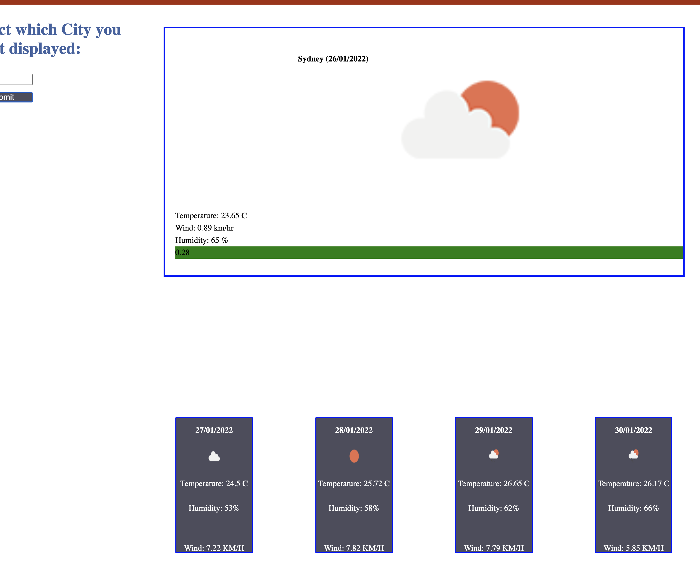

# Weather Application for Current Weather and 5 Day Forecast
## Description
The weather application was built using CSS, HTML and Javascript. The weather data was obtained from the free API openweather.org https://openweathermap.org. 

## User Story
Where someone needs to search for the weather of a city they can type the city they are interested in and it will display the current weather as well as the forecast for the next 5 days. 

## Installation
The application for the weather app can be accessed throught the following github repo:
https://github.com/petergryllis/Weather_App_v1

This website can be viewed at the following link:
https://petergryllis.github.io/Weather_App_v1/ 

## Usage

The application can be accessed by anyone through a web browser at the link above. Once the user has entered the city they seek to search and click submit, they will be presented with the current weather of the city they have selected along with the forecast for this city for the next 5 days.

See screenshot below.

## License
Licensed under the [MIT License](LICENSE).